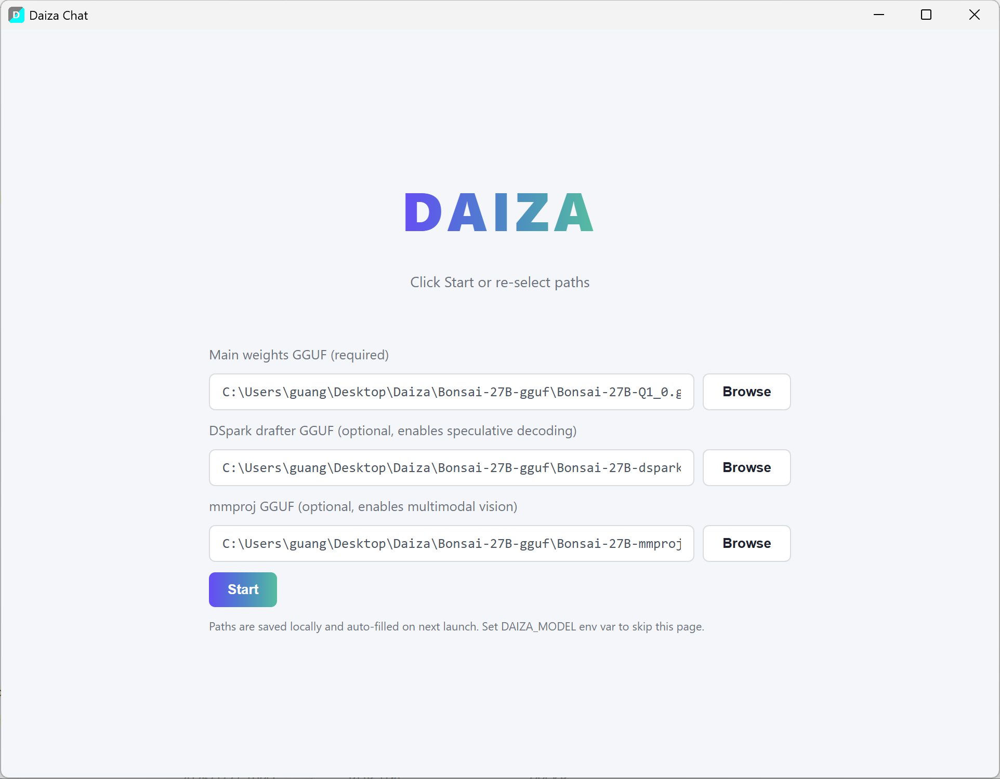
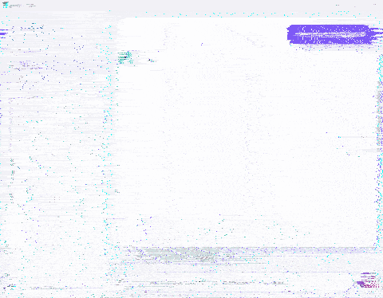

**Languages:** [中文](README.zh.md) | [English](README.md)

# Daiza: A Pure-CPU Rust Inference Engine for 1-bit Bonsai 27B

> **Daiza**(台座) cradles **Bonsai**(盆栽) — a from-scratch Rust engine running the [1-bit Bonsai 27B](https://huggingface.co/prism-ml/Bonsai-27B-gguf) model.

[](LICENSE)
[](https://www.rust-lang.org/)
[](#)

一个学习项目:从零实现 GGUF 解析、Q1_0 反量化、混合注意力(SSM + Full Attention)、GPT-2 BPE 分词,最终在纯 CPU 上完成 Bonsai 27B 的完整推理。

---

## ✨ 特性

- **最小依赖**:仅依赖 `memmap2`(GGUF 权重按需 page-in)+ `image`(PNG/JPEG 解码),其余全部(GGUF 解析、FP16/BF16、BPE、GEMV、SSM、RoPE、AVX2 内核)从零实现
- **纯 CPU**:AVX2 + FMA 手写向量化内核(`target-cpu=native`)
- **Q1_0 反量化**:1.125 bits/weight 二值化格式,每 128 权重共享一个 FP16 scale
- **混合注意力架构**:64 层 = 48 SSM 块 + 16 全注意力块(节拍 `(i+1) % 4 == 0`)
- **M-RoPE**:多模态 RoPE,文本推理时仅旋转时间维(22/64 维)
- **Gated DeltaNet**:SSM 层使用 Gated Delta Rule 循环更新
- **Qwen3.6 chat 模板**:支持 `<|im_start|>` 格式与 `mind` 思考模式标记
- **DSpark 推测解码**:6 层 block-parallel drafter + Markov head + Leviathan rejection sampling;2-gram PLD 查表 drafter 零成本替代神经 drafter,decode 与纯 target 持速 (~7 tok/s)
- **多线程并行**:持久线程池 (park/unpark 零分配),14 线程 GEMM 并行
- **Qwen3-VL 多模态**:CLIP ViT (27 层) + qwen3vl_merger 投影器,支持图像输入,text-only decode 零退化

## 🖼️ 界面预览




### 流式对话演示



### 🎵 彩蛋:从歌词到歌曲

上面 GIF 演示中,模型即兴生成了一段歌词。我们顺手把这段歌词喂给 AI 音乐工具,谱曲演唱成了下面这首歌:

<audio controls src="docs/echoes_of_us.mp3">
  你的浏览器不支持 audio 元素,可直接下载 <a href="docs/echoes_of_us.mp3">echoes_of_us.mp3</a>
</audio>

## 📦 目录结构

```
Daiza/
├── .cargo/config.toml       # target-cpu=native + rsproxy 镜像
├── Cargo.toml               # workspace 根 (lto="fat")
├── README.md
├── Bonsai-27B-gguf/         # 模型权重(外部,不入库)
└── sota-baseline/           # benchmark 脚本(bench/compare/create-baseline)
```

### Crate 依赖层级

```
                    ┌─────────────────┐
                    │  Daiza-engine   │  Layer 0  推理核心 (lib, 零内部依赖)
                    │  gguf/tensor/   │
                    │  math/model/    │
                    │  cache          │
                    └────────┬────────┘
                             │ Cargo 依赖
                    ┌────────▼────────┐
                    │  Daiza-runtime  │  Layer 1  编排层 (lib, 依赖 engine)
                    │  engine/session │
                    │  tokenizer/     │
                    │  tool_call      │
                    └────────┬────────┘
                             │ Cargo 依赖
                   ┌─────────┴─────────┐
                   │                   │
            ┌──────▼──────┐     ┌──────▼──────┐
            │  Daiza-cli  │     │  Daiza-web  │  Layer 2  推理二进制入口
            │  (CLI bin)  │     │  (HTTP bin) │
            └─────────────┘     └──────▲──────┘
                                       │ 运行时 spawn daiza-web.exe 子进程
                                ┌──────┴──────┐
                                │  Daiza-app  │  Layer 3  Tauri 桌面壳
                                │  (Tauri bin)│  (仅依赖 tauri/ureq/serde/base64,
                                └─────────────┘   不依赖 engine/runtime)
```

- **Daiza-engine** (Layer 0):推理核心,零内部依赖。GGUF 解析、Q1_0 反量化、AVX2 GEMM 内核、SSM/Attention/MLP 前向、线程池。
- **Daiza-runtime** (Layer 1):编排层,依赖 engine。Engine 顶层封装、会话管理、GPT-2 BPE 分词器、工具调用、SSD 持久化。
- **Daiza-cli / Daiza-web** (Layer 2):推理二进制入口,Cargo 依赖 engine+runtime。
  - cli:命令行交互
  - web:HTTP+SSE 聊天服务,可独立运行(`daiza-web --model xxx.gguf` 浏览器访问 127.0.0.1:8787)
- **Daiza-app** (Layer 3):Tauri 桌面壳,**不依赖 engine/runtime**,仅依赖 tauri/ureq/serde/base64。运行时 spawn `daiza-web.exe` 子进程提供推理服务,自身负责窗口管理 + SSE 转发(绕过 WebView2 对 127.0.0.1 的 mixed-content 拦截)

> `lto = "fat"` + `codegen-units = 1` 合并所有 crate IR 为单一编译单元,保证跨 crate 内联等效于同 crate(热路径 runtime → engine 的 forward/matvec/AVX2 kernel 调用可被内联)。

### Daiza-engine 模块组织

```
Daiza-engine/src/
├── lib.rs            # 模块入口 + BonsaiError
├── gguf/             # GGUF v3 二进制格式解析(parser/metadata/tensor_info)
├── tensor/           # 张量类型 + Q1_0/Q4_1/Q8_0/Iq1M/F32/F16/BF16 反量化 + AVX2 GEMM 内核
├── math/             # RMSNorm/LayerNorm/RoPE/Softmax/GELU/SIMD 超越函数/采样
├── model/            # Bonsai 27B 架构
│   ├── config.rs / weights.rs / block.rs / attention.rs / ssm.rs / mlp.rs
│   ├── forward.rs    # 单 token 前向 + prefill batch + vision embedding 注入
│   ├── workspace.rs  # 持久线程池(park/unpark 零分配)+ Workspace 复用
│   ├── dspark/       # DSpark 推测解码(drafter/markov/speculative/weights/config)
│   └── vision/       # Qwen3-VL 多模态(config/weights/preprocess/rope/encoder/projector)
└── cache/            # KV cache(16 层)+ SSM state(48 层)
```

### Daiza-runtime 模块组织

```
Daiza-runtime/src/
├── lib.rs            # re-export engine::Engine + daiza_engine::{BonsaiError, Result}
├── engine.rs         # 顶层 Engine:加载→前向→采样→解码 + DSpark + Vision 调度
├── session.rs        # 多轮会话状态
├── session_persist.rs# 会话 SSD 持久化 (.dzss)
├── session_manager.rs# 多会话管理
├── tool_call.rs      # 工具调用解析
└── tokenizer/        # GPT-2 BPE + Qwen35 预分词
```

## 📥 模型权重下载

> 权重文件较大(~6.3 GB 共三件),不入库,需手动下载。

### 前置条件

安装 [Hugging Face CLI](https://huggingface.co/docs/huggingface_hub/guides/cli):

```bash
pip install -U "huggingface_hub[cli]"
```

### 下载权重(三件套)

本引擎目标模型为 `prism-ml/Bonsai-27B-gguf`,需下载以下三个文件:

| 文件 | 大小 | 用途 | 状态 |
|------|------|------|------|
| `Bonsai-27B-Q1_0.gguf` | 3.9 GB | **主权重**(1.125 bits/weight,语言模型) | ✅ 已支持 |
| `Bonsai-27B-dspark-Q4_1.gguf` | 1.8 GB | DSpark 投机解码 drafter | ✅ 已支持 |
| `Bonsai-27B-mmproj-Q8_0.gguf` | 0.63 GB | 视觉塔(多模态输入) | ✅ 已支持 |

**一键下载全部**:

```powershell
# 在仓库根目录执行
hf download prism-ml/Bonsai-27B-gguf `
    Bonsai-27B-Q1_0.gguf `
    Bonsai-27B-dspark-Q4_1.gguf `
    Bonsai-27B-mmproj-Q8_0.gguf `
    --local-dir ./Bonsai-27B-gguf
```

或单独下载主权重:

```powershell
hf download prism-ml/Bonsai-27B-gguf Bonsai-27B-Q1_0.gguf --local-dir ./Bonsai-27B-gguf
```

### 可选:白皮书

```powershell
hf download PrismML-Eng/Bonsai-demo bonsai-27b-whitepaper.pdf --local-dir ./Bonsai-27B-gguf
```

### 镜像源(Hugging Face 不稳定时)

```powershell
# 国内镜像
$env:HF_ENDPOINT="https://hf-mirror.com"
hf download prism-ml/Bonsai-27B-gguf `
    Bonsai-27B-Q1_0.gguf `
    Bonsai-27B-dspark-Q4_1.gguf `
    Bonsai-27B-mmproj-Q8_0.gguf `
    --local-dir ./Bonsai-27B-gguf
```

### 验证下载

```powershell
# 检查文件大小
Get-ChildItem .\Bonsai-27B-gguf\*.gguf | Select-Object Name, @{N='Size(GB)';E={[math]::Round($_.Length/1GB,2)}}

# 使用引擎 inspect 模式验证 GGUF 完整性
.\target\release\daiza-cli.exe --model ".\Bonsai-27B-gguf\Bonsai-27B-Q1_0.gguf" --inspect
```

预期输出包含 `tensor_count : 851`、`block_count : 64`、`Q1_0 tensors: 498`。

## 🚀 快速开始

### 环境要求

- Rust 2021 edition(推荐 1.75+)
- 约 13 GB 可用内存(权重加载)
- x86_64 CPU(AVX2/AVX-512 加速)

### 构建与运行

```powershell
# Release 构建(推荐,workspace 根目录执行,启用 fat LTO + 跨 crate 内联)
cargo build --release --bin daiza-cli

# 运行推理 (chat 模式,默认 64 token)
.\target\release\daiza-cli.exe --model ".\Bonsai-27B-gguf\Bonsai-27B-Q1_0.gguf" --prompt "你好" --max-tokens 64

# Raw 模式(跳过 chat 模板,用于调试)
.\target\release\daiza-cli.exe --model ".\Bonsai-27B-gguf\Bonsai-27B-Q1_0.gguf" --prompt "The capital of China is" --max-tokens 8 --raw

# 启用 DSpark 投测解码(需先下载 drafter 权重)
.\target\release\daiza-cli.exe --model ".\Bonsai-27B-gguf\Bonsai-27B-Q1_0.gguf" `
    --prompt "请用中文写一首关于春天的诗,8句" --max-tokens 200 `
    --dspark ".\Bonsai-27B-gguf\Bonsai-27B-dspark-Q4_1.gguf"

# Greedy 模式(temperature=0, 用于正确性验证)
.\target\release\daiza-cli.exe --model ".\Bonsai-27B-gguf\Bonsai-27B-Q1_0.gguf" `
    --prompt "你好" --max-tokens 100 `
    --dspark ".\Bonsai-27B-gguf\Bonsai-27B-dspark-Q4_1.gguf" --greedy

# 多模态:加载 mmproj 视觉塔并对图像问答 (--image 可多次指定)
.\target\release\daiza-cli.exe --model ".\Bonsai-27B-gguf\Bonsai-27B-Q1_0.gguf" `
    --prompt "描述这张图" --max-tokens 128 `
    --mmproj ".\Bonsai-27B-gguf\Bonsai-27B-mmproj-Q8_0.gguf" --image my_image.jpg

# 检查模型元信息
.\target\release\daiza-cli.exe --model ".\Bonsai-27B-gguf\Bonsai-27B-Q1_0.gguf" --inspect

# 查看帮助
.\target\release\daiza-cli.exe --help
```

### 使用示例

```rust
use daiza_runtime::Engine;
use daiza_engine::math::SamplingParams;

let mut engine = Engine::load("../Bonsai-27B-gguf/Bonsai-27B-Q1_0.gguf")?;
let params = SamplingParams {
    temperature: 0.7,
    top_k: 20,
    top_p: 0.95,
    repetition_penalty: 1.3,
    frequency_penalty: 0.4,
};
let output = engine.generate_with_params(
    "你好",
    256,
    params,
    Some("You are a helpful assistant."),
)?;
println!("{output}");
```

多模态推理示例:

```rust
use std::path::PathBuf;
use daiza_runtime::Engine;
use daiza_engine::math::SamplingParams;

let mut engine = Engine::load("../Bonsai-27B-gguf/Bonsai-27B-Q1_0.gguf")?;
engine.load_mmproj(std::path::Path::new("../Bonsai-27B-gguf/Bonsai-27B-mmproj-Q8_0.gguf"))?;

let output = engine.generate_with_image(
    "描述这张图",
    &[PathBuf::from("my_image.jpg")],
    128,
    SamplingParams::default(),
    Some("You are a helpful assistant."),
)?;
println!("{output}");
```

DSpark 投机解码示例:

```rust
use daiza_runtime::Engine;
use daiza_engine::math::SamplingParams;

let mut engine = Engine::load("../Bonsai-27B-gguf/Bonsai-27B-Q1_0.gguf")?;
// 加载 DSpark drafter (6 层 block-parallel drafter + Markov head)
engine.load_drafter(std::path::Path::new("../Bonsai-27B-gguf/Bonsai-27B-dspark-Q4_1.gguf"))?;

let output = engine.generate_with_params(
    "请用中文写一首关于春天的诗,8句",
    200,
    SamplingParams::default(),
    Some("You are a helpful assistant."),
)?;
println!("{output}");
```

## 📐 架构关键点

### Q1_0 量化格式

每 128 权重 = 1 个 FP16 scale + 16 字节符号位 = 18 字节(1.125 bits/weight)。
反量化公式(白皮书 §4.2):

```
w_i = sg * b_i,  b_i ∈ {-1, +1}
```

其中 `sg` 是 FP16 组内 scale,`b_i` 由单个 bit 决定:`bit=0 → -scale`,`bit=1 → +scale`。
点积核使用 branchless FMA:`acc += scale * (2 * sum_pos_bits - 128)`。

### 混合注意力

| 层类型 | 数量 | 索引 |
|--------|------|------|
| SSM(Gated DeltaNet) | 48 | `i % 4 != 3` |
| Full Attention | 16 | `3, 7, 11, ..., 63` |

- **Full Attention**:24 query head × 4 KV head(GQA group=6),head_dim=256,使用 M-RoPE
- **SSM**:48 value head × 128 state size,Gated Delta Rule 循环更新,前置 Conv1d(kernel=4)

### SSM 层前向流程

```
x → Q/K/V 投影 → Conv1d(因果)→ SiLU → SSM 循环 → 门控 RMSNorm → 输出
```

Gated Delta Rule(autoregressive decode):
- `g = A * softplus(alpha + dt_bias)`,A = ssm_a(已存为 -exp(A_log))
- `decay = exp(g)` → `s *= decay` → `kv = S^T @ k` → `d = (v - kv) * beta` → `S += k ⊗ d` → `y = S^T @ q`

### Qwen3.5 Gated Attention

**关键**:`attn_q` 输出 12288 维按 head 交错排列:
```
[Q_head0(256) | gate_head0(256) | Q_head1(256) | gate_head1(256) | ...]
```
**不是** `[全部 Q(6144) | 全部 gate(6144)]`。此交错格式是 Bonsai 的核心实现细节。

### Chat 模板

```text
<|im_start|>system
{system}<|im_end|>
<|im_start|>user
{user}<|im_end|>
<|im_start|>assistant
mind
```

模型进入思考模式,输出 `mind ... </mind>` 包裹的思考内容,然后给出最终回复。EOS token(`<|im_end|>`, id=248046)终止生成。

### Qwen3-VL 多模态管线

参考 [llama.cpp qwen3vl.cpp](https://github.com/PrismML-Eng/llama.cpp) 实现,加载时一次性把 Q8_0/F16 反量化为 F32 (~1.6GB),运行时纯 F32 路径。

```
image → resize(768×768,Lanczos3) → normalize → patchify(16×16, 2304 patches × 768 dim)
       ↓
门控 patch embedding: Conv2D(W) + Conv2D(W.1) + bias → [2304, 1152]
       ↓
+ learned position_embd [1152, 2304]
       ↓
27 层 ViT block:
  LN1(bias) → QKV proj (fused 3456) → M-RoPE(Q,K) → bidirectional attn → out_proj → +residual
  → LN2(bias) → ffn_up(1152→4304) → GELU → ffn_down(4304→1152) → +residual
       ↓
post_ln → [2304, 1152]
       ↓
qwen3vl_merger 投影器:
  spatial_merge(2×2 块合并, 2304→576 patches, reshape 到 [4608, 576])
  → Linear(4608→4608) → GELU → Linear(4608→5120)
       ↓
[576, 5120] vision embeddings (与 text model hidden_dim=5120 一致)
```

**关键细节**:
- M-RoPE sections `[head_dim/4]×4 = [18,18,18,18]`,位置 IDs 为 4D `(t=0, h=py, w=px, extra=0)`,只应用在 Q/K
- 门控 patch embedding:两个相同形状 `[16,16,3,1152]` 的 Conv2D 权重相加
- attention bidirectional(无 causal mask),所有 patch 互相可见
- LayerNorm 带 bias(ViT 风格,非 RMSNorm),GELU 用 tanh 近似
- **vision 注入只在 prefill 阶段**,text-only decode 走 `forward_single_token` 零退化

**性能** (768×768 测试图,Intel Core Ultra 5 225H):

| 阶段 | 时间 | 说明 |
|------|------|------|
| preprocess | ~9ms | resize + patchify |
| ViT encode (27 层) | ~8.2s | AVX2 batched matmul + 8-row dot product kernel + AVX2 attention (hoist q_i) |
| projector | ~0.19s | batched matmul + AVX2 |
| prefill (602 expanded tokens) | ~103s | ~165ms/tok,vision 分批 batched 注入 (MAX_VISION_BATCH=64) |
| decode (48 tokens) | ~8.3s | 173ms/tok,与 text-only 一致 |

ViT encode 从标量 173s 优化到 8.2s(**22× 加速**):线程池并行 → 2D tiled batched matmul → AVX2 8-row dot product kernel → AVX2 attention kernel → projector batched.

Vision prefill 从逐 token 注入 (132s) 改为分批 batched 注入 (MAX_VISION_BATCH=64, 100s),text-only decode 零退化。

## ⚙️ 生成参数(白皮书建议)

| 参数 | 建议值 |
|------|--------|
| temperature | 0.7 |
| top_k | 20 |
| top_p | 0.95 |

这些设置用于 Bonsai 27B 所有 benchmark 结果(thinking mode)。

## 🏎️ 性能调优

性能旋钮通过环境变量配置(进程级 OnceLock 缓存,启动时读取一次)。换硬件/散热条件后,
用内置自调优一键找到推荐配置:

```powershell
# 交错子进程 sweep + 确认门限 (≥5% 优势才覆盖默认), 耗时 ~8-15 分钟
.\target\release\daiza-cli.exe --model <gguf_path> --calibrate
```

核心旋钮:

| 环境变量 | 作用 | 默认 | 225H 实测 |
|----------|------|------|----------|
| `DAIZA_GEMM_T_SUB` | prefill GEMM t-subdivision(×切片粒度:L2 驻留与 prep 重复的平衡) | 32 | 32 最优(孤立 bench 中 64/128 退化 2%/9%,E2E 打平) |
| `DAIZA_ACTIVE_WORKERS` | 长跑活跃 worker 数(热平衡:超过热预算后降频反噬) | min(9, 全核) | 9 (13 线程: 4P+8E+2LP-E) |
| `DAIZA_MATVEC_CHUNK` | decode matvec work-stealing 粒度 | 128 | 128 比 256 快 ~15%(E 核 straggler 尾巴更短) |

> 笔记本等热耦合设备上短跑基准的槽位噪声可达 ±5%~50%;手动调参请用交错 A/B + min,
> 或直接信任 `--calibrate` 的确认门限。

## 📊 性能参考(纯 CPU)

测试硬件:Intel Core Ultra 5 225H (Meteor Lake, 14 核, AVX2 + FMA, LPDDR5X-7467)
测试条件:greedy 采样,142-token prompt

| 阶段 | 性能 | 说明 |
|------|--------|------|
| prefill (142 token) | ~10.0s (~71ms/token) | 达 FMA roofline ~95%(实测 ~715 GFLOPS vs 峰值 755) |
| decode | ~143ms/token (7.0 tok/s) | Q1_0 LUT 内核 FMA port 饱和,V0-V6 变体空间已穷尽 |

- decode 阶段 block 分解(热态 profile):attn(16) ~34ms + ssm(48) ~102ms + mlp(64) ~85ms + lm_head 6ms,MLP 占 58% 已饱和
- 内存带宽实测 ~120 GB/s;decode 为 compute-bound(带宽地板 ~29ms vs 实测 143ms),瓶颈在 LUT 查表的 FMA 吞吐而非带宽
- 内存占用:~13 GB (Q1_0 权重) + ~1.3 GB (KV/SSM/激活) + ~1.6 GB (mmproj,可选)
- prefill 优化战役(17 个 perf commit):GEMM dispatch 修复 + f16 scratch + L2 布局参数调优 +
  串行段并行化(attention online softmax/SSM scan/swiglu 跨 token 并行)+ 混核 work-stealing,
  16.4s → 10.0s (-39%);所有优化 greedy 逐字节一致,零质量损失
- DSpark:n-gram PLD drafter 消除 53ms 神经 drafter 开销,decode 与纯 target 持速;
  batched verify 经数据否决(Q1_0 LUT compute-bound 下无摊销空间,接受率 p=0.08 时效率 0.62×)
- Vision:text-only 加载 mmproj 零退化;with-image 旧测 decode ~173ms/token,一次性成本
  (ViT 编码 ~8s + vision prefill ~100s)——优化战役前测量,仅供参考

**说明**:这是学习项目。纯 CPU + Q1_0 + 逐字节一致约束下,当前已触及本硬件极限
(prefill 达 FMA roofline 95%,decode 达 LUT 内核 FMA port 饱和);进一步突破需 AVX-512/AMX(本机无)。
商业部署请使用 [llama.cpp PrismML fork](https://github.com/PrismML-Eng/llama.cpp)。

## 🗺️ 路线图

- [x] Q1_0 主权重文本推理
- [x] 混合注意力(SSM + Full Attention)
- [x] Chat 模板与思考模式
- [x] 多线程并行(持久线程池 + AVX2 手写内核)
- [x] DSpark 投机解码(`Bonsai-27B-dspark-Q4_1.gguf`)
- [x] 多模态视觉输入(`Bonsai-27B-mmproj-Q8_0.gguf`)
- [x] ViT encoder AVX2 向量化 + 线程池并行(173s/图 → 7.9s/图,22× 加速)
- [x] Vision prefill batched(逐 token 注入 → 分批 64 个,132s → 100s,text-only 零退化)
- [x] prefill GEMM 优化战役(17 个 perf commit,16.4s → 10.0s,-39%,逐字节一致):GEMM dispatch 修复、f16 scratch、L2 布局调优、串行段跨 token 并行、P/E/LP-E 混核 work-stealing
- [x] `--calibrate` 自调优子命令(交错 sweep + 确认门限,一键输出推荐 env)

> 路线图已完成。纯 CPU + Q1_0 + 逐字节一致约束下已触及本硬件极限:prefill 达 FMA roofline ~95%,
> decode 达 LUT 内核 FMA port 饱和(进一步突破需 AVX-512/AMX)。KV cache 4-bit 量化经调研后判定
> 不值得实施(KV cache 读取占带宽 <0.01%,4-bit 量化收益 <1%,且违反"不得降低模型精度"硬约束)。

## 📚 参考资料

- [1-bit Bonsai 27B 白皮书](https://github.com/PrismML-Eng/Bonsai-demo/blob/main/bonsai-27b-whitepaper.pdf)
- [Bonsai-27B-gguf Hugging Face 仓库](https://huggingface.co/prism-ml/Bonsai-27B-gguf)
- [GGUF 格式规范](https://github.com/ggerganov/ggml/blob/master/docs/gguf.md)
- [Qwen3 模型架构](https://github.com/QwenLM/Qwen3)
- [llama.cpp PrismML fork (qwen3vl 参考)](https://github.com/PrismML-Eng/llama.cpp)
- [Qwen3-VL 多模态架构](https://github.com/QwenLM/Qwen3-VL)

## 📄 许可证

Apache-2.0(与上游 Bonsai 27B 模型一致)

> AI生成